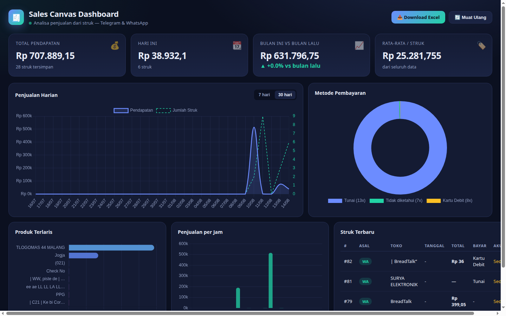
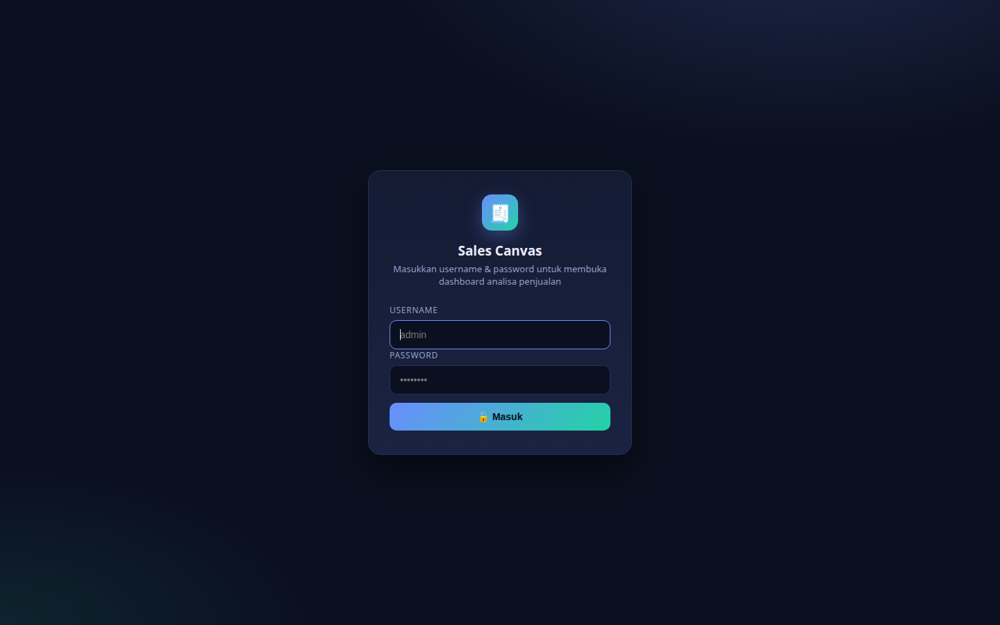

# 🧾 Sales Canvas Bot — Telegram & WhatsApp


> **Proyek portofolio:** bot pembukuan penjualan otomatis dari foto struk —
> OCR → parser struk Indonesia → database → laporan & dashboard analisa.

Bot yang menerima **laporan sales berupa foto struk**, membacanya otomatis (OCR),
menyimpan ke **database SQLite**, lalu menyediakan **analisa data** lewat:
perintah di bot (Telegram & WhatsApp) dan **dashboard web** (grafik).

```
foto struk ──▶ Telegram bot ──┐
foto struk ──▶ WhatsApp bot ──┼──▶ OCR (Tesseract) ──▶ Parser struk ──▶ SQLite
                              │                                        │
perintah laporan ◀────────────┘            dashboard web ◀─────────────┘
```

### 🖥️ Live Demo

- **Dashboard:** https://sales-bot-api-ha3l.onrender.com (login `kozoadmin` + password)
- **Bot Telegram:** cari `@rceipt_sales_bot` di Telegram
- **Bot WhatsApp:** kirim foto struk ke nomor bot (setelah QR di-scan)

> Deployment memakai [Render](https://render.com) free tier (lihat bagian
> *Deploy ke Render* di bawah).

### 📸 Tangkapan Layar

**Dashboard analisa penjualan** — total pendapatan, grafik harian, produk terlaris,
metode pembayaran, dan struk terbaru:



**Halaman login** (username + password):



---

## ✨ Fitur

| Fitur | Keterangan |
|---|---|
| 📷 Terima foto struk | dari Telegram (foto) & WhatsApp (foto) |
| 🔍 OCR Bahasa Indonesia | Tesseract `ind+eng` + preprocessing OpenCV (binerisasi, deskew, upscale) |
| 🧾 Parser struk | ekstrak toko, tanggal, jam, item, subtotal, pajak, total, metode bayar |
| 🗄️ Database | SQLite (tabel `receipts` & `items`) |
| 📊 Dashboard web | penjualan harian, produk terlaris, metode bayar, penjualan per jam, struk terbaru |
| 🤖 Perintah laporan | `/laporanharian`, `/laporanmingguan`, `/laporanbulanan`, `/produkterlaris`, `/total` (bisa juga dengan garis bawah: `/laporan_harian`, dst.) |
| 🎛️ Menu WhatsApp | ketik `menu`/`tombol`/`bantuan` → daftar bernomor `1`–`7` (bekerja di Web/Desktop/HP) + tombol interaktif (bisa diketuk di HP) |
| 📥 Ekspor Excel | tombol **Download Excel** di dashboard atau `/export` di Telegram → file `.xlsx` (sheet Struk + Item) |
| 📆 Laporan selalu terisi | struk tanpa tanggal (OCR gagal baca) dihitung sebagai penjualan hari ini — laporan harian tidak lagi "0 struk" |
| 🛡️ Anti respond-sendiri | dedup id pesan (tersimpan ke file) + filter pesan lama dari perangkat sendiri — bot tidak membalas pesan lama/duplikat |
| 🗄️ Backup otomatis | DB SQLite di-backup otomatis ke `data/backup/` (tiap start + harian), disimpan 7 hari |
| ♻️ Auto-restart | `scripts/watchdog.sh` memantau & me-restart bridge WhatsApp dan server API bila mati |
| 🛡️ Guard OCR | timeout + batas konkurensi tesseract (anti-hang saat banyak foto masuk); watchdog membunuh proses OCR macet otomatis |
| 🔑 Login dashboard | username + password (`DASHBOARD_USERNAME` / `DASHBOARD_PASSWORD`) melindungi dashboard & seluruh API |
| ✅ Unit test | `pytest tests/` (69 test) — parser, perintah bot, analytics, alur login, ekspor |
| 🔌 Tanpa sudo | Tesseract bisa disalin ke folder `vendor/` (sudah disertakan) |

---

## 🗂️ Struktur Project

```
├── run.py                      # jalankan server API + bot Telegram
├── app/
│   ├── config.py               # konfigurasi dari .env
│   ├── database.py             # SQLite (receipts, items)
│   ├── ocr.py                  # preprocessing OpenCV + Tesseract
│   ├── parser.py               # parse teks struk Indonesia
│   ├── analytics.py            # analisa data (pandas)
│   ├── process.py              # pipeline bersama kedua bot
│   ├── bots/
│   │   ├── telegram_bot.py     # bot Telegram
│   │   └── whatsapp_api.py     # webhook untuk bridge WhatsApp
│   └── web/
│       ├── server.py           # FastAPI: API analytics + dashboard
│       └── dashboard.html      # halaman dashboard (Chart.js)
├── whatsapp-bridge/            # bridge WhatsApp (Node.js + Baileys)
│   └── index.js
├── scripts/make_sample_receipt.py  # bikin struk contoh untuk uji coba
├── vendor/tesseract/           # Tesseract lokal (tanpa sudo)
└── data/                       # database + upload struk (dibuat otomatis)
```

---

## 🚀 Cara Menjalankan

### 0. Cara paling cepat: Docker

```bash
cp .env.example .env                          # isi TELEGRAM_BOT_TOKEN & BRIDGE_WEBHOOK_SECRET
cp whatsapp-bridge/.env.example whatsapp-bridge/.env

docker compose up -d --build

docker compose logs -f bridge                 # scan QR WhatsApp (sekali saja)
# QR juga tersedia sebagai gambar: buka http://IP-SERVER:3100/qr di browser
```

Buka dashboard: **http://IP-SERVER:8000/dashboard**

> Bot Telegram & API berjalan sebagai container `sales-bot-api`, bridge WhatsApp
> sebagai `sales-bot-whatsapp`. Data SQLite (folder `./data`) dan session WhatsApp
> (`./whatsapp-bridge/auth`) tersimpan di disk dan tetap ada walau container di-restart.
> Perlu **VPS/PC yang menyala 24 jam** agar bot selalu online.

### 1. Persiapan environment (tanpa Docker)

```bash
# Salin contoh konfigurasi
cp .env.example .env
cp whatsapp-bridge/.env.example whatsapp-bridge/.env

# Python
python3 -m venv .venv
.venv/bin/pip install -r requirements.txt

# Node (bridge WhatsApp)
cd whatsapp-bridge && npm install && cd ..
```

### 2. Tesseract (OCR)

Dua pilihan — project ini sudah menyertakan salinan di `vendor/tesseract/`,
jadi **biasanya tanpa install apa pun sudah jalan** (otomatis terdeteksi).

Alternatif resmi (perlu sudo sekali):
```bash
sudo apt install tesseract-ocr tesseract-ocr-ind
```

> Jika `vendor/` dihapus dan Tesseract sistem tidak ada, bot akan memberi
> peringatan saat menerima foto.

### 3. Token bot Telegram

1. Buka [@BotFather](https://t.me/BotFather) di Telegram → `/newbot`.
2. Salin token ke `.env`:
   ```env
   TELEGRAM_BOT_TOKEN=123456:ABC-DEF...
   BRIDGE_WEBHOOK_SECRET=buat-string-acak-panjang
   ```
3. (Opsional) Batasi pengguna: `TELEGRAM_ALLOWED_IDS=123456789`

### 4. Jalankan

```bash
# Terminal 1 — server API + dashboard + bot Telegram
.venv/bin/python run.py

# Terminal 2 — bridge WhatsApp (scan QR sekali di awal)
cd whatsapp-bridge && node index.js
```

Saat pertama kali bridge berjalan, **scan QR** yang muncul di terminal dengan
WhatsApp: *Pengaturan → Perangkat tertaut → Tautkan perangkat*.

QR juga otomatis **disimpan sebagai gambar** (`whatsapp-bridge/qr.png`) dan bisa
**dilihat di browser** dengan membuka **http://localhost:3100/qr** (halaman
auto-refresh tiap beberapa detik) — praktis untuk VPS tanpa layar langsung.
Endpoint mentahnya: `GET /qr.png`.

> Sering salah port? Buka **http://localhost:8000/qr** (port API) juga bisa —
> otomatis dialihkan ke bridge (port 3100). Berlaku juga untuk `/qr.png` dan
> bekerja dari IP VPS (host request diteruskan sama).

### 5. Uji coba

Kirim foto struk ke bot Telegram, atau ke nomor WhatsApp Anda.
Tanpa struk asli? Buat struk contoh lalu kirim gambarnya:

```bash
.venv/bin/python scripts/make_sample_receipt.py
```

Buka dashboard: **http://localhost:8000/dashboard**

> 💡 **Proteksi dashboard:** isi `DASHBOARD_PASSWORD` di `.env` untuk mengunci
> dashboard & seluruh API dengan halaman login. Tanpa password ini, dashboard
> bisa diakses siapa saja yang tahu alamat server-nya. Endpoint webhook WhatsApp
> (`/api/whatsapp/*`) dan `/api/health` selalu publik (webhook sudah memakai
> `BRIDGE_WEBHOOK_SECRET` sendiri).
>
> 🔒 **Halaman QR WhatsApp** (`http://IP:3100/qr`) juga bisa dikunci dengan
> mengisi `QR_PASSWORD` di `whatsapp-bridge/.env` (bisa sama dengan
> `DASHBOARD_PASSWORD`). Tanpa `QR_PASSWORD`, halaman QR terbuka — siapa pun
> yang melihatnya bisa menautkan perangkat ke WhatsApp Anda.

---

## 🤖 Perintah Bot

| Perintah | Fungsi |
|---|---|
| `/laporanharian` (`/laporan_harian`) | Penjualan hari ini + jam tersibuk (struk tanpa tanggal dihitung hari ini) |
| `/laporanmingguan` (`/laporan_mingguan`) | Rincian 7 hari terakhir |
| `/laporanbulanan` (`/laporan_bulanan`) | Pendapatan bulan ini, pertumbuhan vs bulan lalu, produk terlaris |
| `/produkterlaris` (`/produk_terlaris`) | 10 produk terlaris (berdasarkan nilai penjualan) |
| `/total` | Ringkasan seluruh data |
| `/export` | Unduh seluruh data sebagai file Excel (.xlsx) |
| `/bantuan` | Daftar perintah |

Perintah yang sama bisa diketik langsung di chat WhatsApp.

### 🎛️ Menu perintah di WhatsApp

Ketik **`menu`** (atau `tombol` / `bantuan`) di chat WhatsApp → bot mengirim:

1. **Daftar bernomor** `1`–`7` — teks biasa, **bekerja di WhatsApp Web,
   Desktop, dan HP** (cukup balas angkanya, mis. `1` = Laporan Harian).
2. **Tombol interaktif** — hanya bisa diketuk di **HP**. Di WhatsApp Web/Desktop
   tombol tampil sebagai gelembung "Tersedia di WhatsApp — buka di HP"
   (keterbatasan WhatsApp, bukan bug bot); cukup gunakan angka di Web.

Perintah juga bisa diketik langsung dengan **bahasa alami** tanpa garis miring:
`laporan harian`, `1.laporan harian`, `Laporan Harian`, dst.

### 🔒 Batasi siapa yang boleh memakai bot (Telegram & WhatsApp)

**Satu daftar nomor (whitelist) mengontrol akses ke kedua bot** — nomor yang
tidak terdaftar ditolak, baik di Telegram maupun WhatsApp.

**WhatsApp** — secara default **semua nomor** yang mengirim ke nomor WhatsApp
Anda bisa memakai bot. Nomor yang tidak terdaftar otomatis ditolak (mendapat
balasan "nomor tidak terdaftar"), dan pesan dari perangkat Anda sendiri (chat
ke diri sendiri) **selalu** diproses.

**Telegram** — Telegram tidak memberitahu bot nomor pengguna kecuali ia
membagikannya. Saat whitelist aktif, pengguna baru yang mengirim pesan diminta
mengetuk tombol **📱 Bagikan Nomor** sekali; nomornya dicocokkan dengan
whitelist dan bila cocok akses langsung dibuka. User id-nya diingat di
`data/telegram_verified.json`, jadi tidak perlu membagikan nomor lagi setelah
itu (nomor yang nanti dihapus dari whitelist otomatis kehilangan akses).
`TELEGRAM_ALLOWED_IDS` tetap berlaku sebagai izin tambahan berbasis ID — user
yang ada di daftar itu tidak perlu verifikasi nomor.

**Kelola daftar nomor lewat bot Telegram** (tanpa edit file):

| Perintah | Fungsi |
|---|---|
| `/whitelist` | Lihat daftar nomor yang diizinkan |
| `/izinkan 628123456789` | Tambah nomor ke whitelist (Telegram & WhatsApp) |
| `/blokir 628123456789` | Hapus nomor dari whitelist |

Tombol **📋 Whitelist / ➕ Izinkan / ➖ Blokir** tersedia di menu keyboard
Telegram. Ketuk ➕ atau ➖ lalu **ketik nomornya di pesan berikutnya** — bot
langsung memproses tanpa perlu mengetik perintah lengkap (atau ketik manual
`/izinkan 628xxx`).

Daftar tersimpan di `whatsapp-bridge/allowed-numbers.json` (persisten antar
restart) dan disinkronkan langsung ke bridge. Nilai awal bisa diatur lewat
`WHATSAPP_ALLOWED_NUMBERS` di `whatsapp-bridge/.env` (format nomor internasional
tanpa `+`, pisah koma). Kosongkan untuk mengizinkan semua nomor lagi.

> Di platform dengan disk ephemeral (mis. Render free tier), file ini bisa
> hilang saat redeploy — pakai env var `WHATSAPP_ALLOWED_NUMBERS` agar daftar
> selalu ada.

> 🛡️ **Pengaman:** nomor **terakhir** di daftar tidak bisa dihapus via
> `/blokir` — karena daftar kosong berarti kembali ke mode "semua nomor boleh".
> Bot akan menolak dengan pesan yang jelas. Hapus manual di file jika memang
> ingin membuka akses untuk semua orang.
>
> 💡 **Akun LID:** sebagian akun WhatsApp memakai identitas LID (mis.
> `177798912163960@lid`) yang berbeda dari nomor teleponnya. Jika nomor yang
> sudah di-whitelist tetap ditolak, cek log bridge — pesan penolakan kini
> menampilkan **angka yang terdeteksi** dari pengirim, pakai angka itu untuk
> `/izinkan`.

> Di Telegram, tombol perintah tampil otomatis di bawah kolom ketik setelah
> mengetik `/start` atau `/bantuan`.

---

## 📊 Dashboard Web

Berisi: total pendapatan, jumlah struk, penjualan hari ini, pertumbuhan bulanan,
grafik penjualan harian (7/30 hari), metode pembayaran (donut), produk terlaris
(bar), penjualan per jam, tabel struk terbaru, dan tombol **Download Excel**
(seluruh data → file .xlsx). Auto-refresh tiap 60 detik.

---

## 🚢 Deploy ke VPS dengan Docker

1. **Siapkan VPS** (Ubuntu 22.04/24.04 disarankan) dengan Docker:
   ```bash
   # Install Docker
   curl -fsSL https://get.docker.com | sh
   sudo usermod -aG docker $USER
   # logout-login agar grup docker aktif
   ```
2. **Clone repo:**
   ```bash
   git clone https://github.com/Faber-Aritonang/receipt-sales-bot.git
   cd receipt-sales-bot
   ```
3. **Konfigurasi:**
   ```bash
   cp .env.example .env
   cp whatsapp-bridge/.env.example whatsapp-bridge/.env
   nano .env    # isi TELEGRAM_BOT_TOKEN (dari @BotFather) & ganti BRIDGE_WEBHOOK_SECRET
   ```
4. **Jalankan:**
   ```bash
   docker compose up -d --build
   docker compose logs -f bridge   # scan QR WhatsApp, lalu Ctrl+C (container tetap jalan)
   docker compose ps
   ```
5. **Buka dashboard:** `http://IP-VPS:8000/dashboard`

> ⚠️ Buka port 8000 (dan 3100 jika perlu) di firewall VPS. Untuk HTTPS/domain,
> bisa gunakan Nginx reverse-proxy + Let's Encrypt.

---

## 🚢 Deploy ke Render (Blueprint)

Repo sudah menyertakan `render.yaml` (Render Blueprint) yang membuat **2 Web
Service** sekaligus: `sales-bot-api` (FastAPI + dashboard + bot Telegram) dan
`sales-bot-bridge` (bridge WhatsApp).

1. Push repo ini ke GitHub.
2. Buka **https://dashboard.render.com/blueprints** → *New Blueprint Instance* →
   pilih repo ini. Render membaca `render.yaml` dan membuat kedua service.
3. Isi environment variable yang bertanda *isi manual* di dashboard:
   - **api**: `TELEGRAM_BOT_TOKEN`, `BRIDGE_WEBHOOK_SECRET`, `BRIDGE_URL`
     (= `https://<nama-bridge>.onrender.com`), opsional `DASHBOARD_PASSWORD`.
   - **bridge**: `PYTHON_API_URL` (= `https://<nama-api>.onrender.com`),
     `BRIDGE_WEBHOOK_SECRET` (harus **sama** dengan api), opsional
     `WHATSAPP_ALLOWED_NUMBERS` dan `QR_PASSWORD`.
4. Setelah service jadi, buka log bridge → **scan QR WhatsApp**, atau buka
   `https://<nama-bridge>.onrender.com/qr` di browser.

Dashboard: `https://<nama-api>.onrender.com/dashboard`.

> ⚠️ **Free tier — hanya untuk uji coba.** `render.yaml` memakai `plan: free`
> (tanpa Persistent Disk), sehingga **semua data hilang setiap restart/redeploy**:
> DB SQLite (struk tercatat), session WhatsApp (harus scan QR ulang), dan file
> whitelist. Service juga **tidur setelah ~15 menit** tanpa lalu lintas masuk —
> saat tidur, WhatsApp putus dan bot tidak menerima pesan sampai URL-nya
> dibuka. Untuk produksi, ubah `plan` ke `starter` dan aktifkan blok `disk`
> yang sudah dikomentari di `render.yaml` (atau pakai VPS 24 jam).
>
> 🔒 **Whitelist di Render:** set `WHATSAPP_ALLOWED_NUMBERS` sebagai env var
> di service bridge — env var selalu ada walau file `allowed-numbers.json`
> hilang saat redeploy.

---

## 🔧 Konfigurasi (.env)

| Variabel | Fungsi |
|---|---|
| `TELEGRAM_BOT_TOKEN` | Token dari BotFather (kosong = bot Telegram nonaktif) |
| `TELEGRAM_ALLOWED_IDS` | ID pengguna yang boleh memakai bot tanpa verifikasi nomor (kosong = hanya whitelist nomor yang berlaku) |
| `BRIDGE_WEBHOOK_SECRET` | Rahasia bersama bridge Node ↔ server Python |
| `DASHBOARD_USERNAME` | Username login dashboard (default `kozoadmin`) |
| `DASHBOARD_PASSWORD` | Password untuk membuka dashboard (kosong = tanpa login; API lain ikut terlindungi) |
| `WATCHDOG_NOTIFY_CHAT_ID` | Chat id Telegram untuk notifikasi restart watchdog (opsional) |
| `BACKUP_KEEP_DAYS` | Berapa hari backup DB disimpan di `data/backup/` (default 7) |
| `QR_PASSWORD` (di `whatsapp-bridge/.env`) | Password untuk halaman QR WhatsApp (kosong = terbuka) |
| `WHATSAPP_ALLOWED_NUMBERS` (di `whatsapp-bridge/.env`) | Whitelist nomor yang boleh memakai bot Telegram & WhatsApp (kosong = semua nomor) |
| `API_PORT` | Port dashboard (default 8000) |
| `OCR_LANG` | Bahasa OCR (default `ind+eng`) |
| `TESSERACT_CMD` / `TESSDATA_PREFIX` | Path tesseract (opsional, otomatis pakai vendor) |

---

## 🧪 Unit Test

```bash
.venv/bin/python -m pytest tests/ -v
node scripts/test_whitelist.js   # unit test whitelist WhatsApp (tanpa koneksi)
```

69 test Python mencakup: parser struk (`app/parser.py`), perintah bot
(`app/process.py` — termasuk bentuk nomor menu & bahasa alami), analytics
(`app/analytics.py` — termasuk struk tanpa tanggal), alur login dashboard
(username+password, logout, proteksi API — `app/web/server.py`), ekspor Excel
(`app/export.py`), klien whitelist (`app/whitelist.py`), dan alur tombol
whitelist di bot Telegram (minta nomor → proses; `/whitelist` tidak memicu
ekspor; `/export` mengirim file). Test memakai database sementara — data asli
di `data/` tidak pernah tersentuh. Test Node (33 test) mencakup logika
whitelist di bridge (normalisasi nomor, add/remove/list, guard nomor terakhir,
`isAllowedSender`, pemetaan akun LID).

## 🗄️ Backup Otomatis

DB SQLite di-backup otomatis ke `data/backup/sales_YYYY-MM-DD_HHMMSS.db`:
- saat server start (hanya jika belum ada backup hari ini), dan
- sekali per 24 jam selagi server berjalan.

Backup lebih dari `BACKUP_KEEP_DAYS` hari (default 7) dihapus otomatis.
Jalankan manual:
```bash
.venv/bin/python -m app.backup
```

## ♻️ Auto-restart (watchdog)

Server API dan bridge WhatsApp kadang bisa mati sendiri (koneksi putus, error
tak terduga). `scripts/watchdog.sh` memantau keduanya setiap 20 detik dan
me-restart otomatis. Ada dua cara menjalankannya:

**Cara 1 — systemd user service (disarankan, auto-start saat boot):**
```bash
# sekali saja — aktifkan agar service tetap jalan tanpa login
loginctl enable-linger $USER

# pasang & aktifkan service
bash scripts/install_watchdog_systemd.sh

# cek status / log
systemctl --user status sales-watchdog.service
cat /tmp/watchdog.log
```

**Cara 2 — manual (background):**
```bash
setsid nohup bash scripts/watchdog.sh > /tmp/watchdog.log 2>&1 < /dev/null &
```

### 🔔 Notifikasi restart via Telegram (opsional)

Isi `WATCHDOG_NOTIFY_CHAT_ID` di `.env` (chat id Telegram Anda) — watchdog
akan mengirim pesan ke Telegram setiap kali ia me-restart API atau bridge
(tanpa nilai ini, fallback ke `TELEGRAM_ALLOWED_IDS` pertama; keduanya kosong
= tanpa notifikasi).

Log aktivitas bot: `tail -f /tmp/api_live.log` (API) dan
`tail -f /tmp/bridge_live.log` (bridge WhatsApp).

> ⚠️ **Penting:** service systemd menjalankan bridge dengan **Node dari nvm
> (v20)** — Node sistem (v18) tidak mendukung `require()` modul ESM Baileys.
> Unit file sudah menyetel PATH yang benar, jadi tidak perlu tindakan apa pun.

## 🧪 Uji End-to-End Otomatis

```bash
bash scripts/e2e_test.sh
```

Memverifikasi seluruh rantai layanan sekaligus: health API & bridge, proteksi
dashboard, perintah bot (webhook WhatsApp → laporan), **foto struk nyata**
(OCR → tersimpan di DB → balasan "Struk tersimpan"), **whitelist WhatsApp**
(add/remove nomor uji + 401 tanpa secret), dan service watchdog systemd.
Exit code 0 = semuanya sehat. Cocok dijalankan lewat cron/systemd timer untuk
pemantauan berkala.

## 🧪 Catatan Teknis

- **Akurasi OCR** bervariasi tergantung kualitas foto. Foto yang miring/kusam
  bisa membuat beberapa field kosong. Setiap struk diberi label akurasi
  (tinggi/sedang/rendah) di dashboard & balasan bot.
- Untuk akurasi jauh lebih tinggi (struk kusam/handphone miring), ganti modul
  OCR ke API vision (mis. OpenAI GPT-4o) — lihat `app/ocr.py`.
- Data tersimpan lokal di `data/sales.db` (SQLite). Backup cukup dengan
  menyalin folder `data/`.
- **Risiko nomor WhatsApp**: Baileys memakai koneksi tidak resmi. Hindari
  pesan massal/spam; untuk produksi komersial gunakan
  [WhatsApp Business Cloud API](https://developers.facebook.com/docs/whatsapp/cloud-api)
  (resmi Meta).

---

## 🐙 Repositori

Project ini open-source (MIT) di:
https://github.com/Faber-Aritonang/receipt-sales-bot
